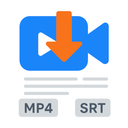
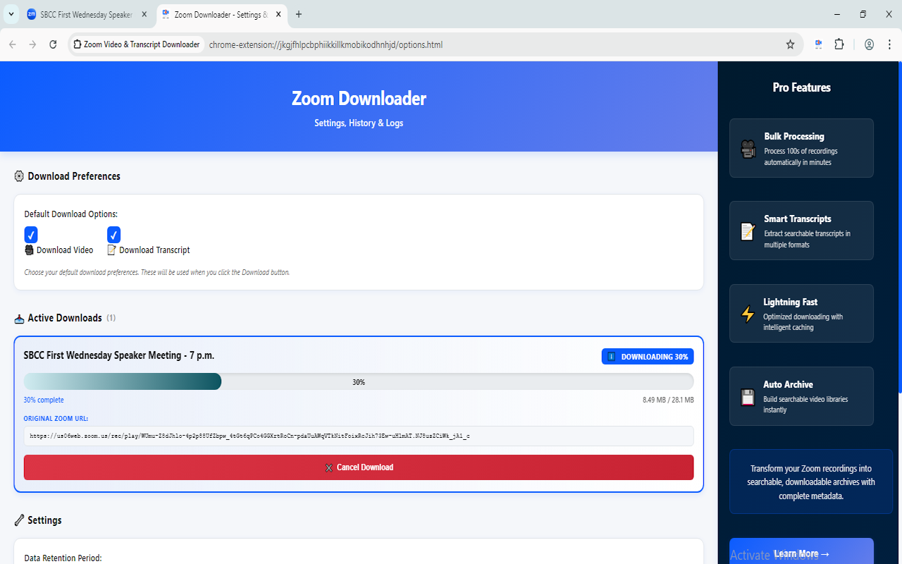

# 🎥 Zoom Video & Transcript Downloader

### Download Zoom Recordings & Transcripts with One Click

**No waiting. No conversion. Direct downloads + automatic transcripts.**

<a href="https://chromewebstore.google.com/detail/mpdggjbngdhfmkojnemnfpmbbpjkknjo" target="_blank" rel="noopener noreferrer">**📥 Install from Chrome Web Store**</a> | <a href="https://youtu.be/zIM589Jm5cc" target="_blank" rel="noopener noreferrer">**📺 Video Tutorial**</a> | [**💬 Support**](#support)

---

## 🚀 What Does This Extension Do?

**Zoom Video & Transcript Downloader** extracts direct download links from Zoom recordings and automatically fetches transcripts. Perfect for students, professionals, and educators who need to save and organize Zoom content.

### ✨ Key Features

| Feature | Description |
|---------|-------------|
| **🎬 One-Click Downloads** | Extract MP4 links in seconds |
| **📝 Auto Transcripts** | Get searchable transcripts automatically |
| **📋 Download Queue** | Queue multiple recordings with progress tracking |
| **📚 Smart History** | Track all downloads with searchable records |
| **🔒 100% Private** | Everything stored locally zero tracking |
| **⚡ Multi-Format** | Works with recordings, events, and clips |

---

## 🎯 Supported Zoom URL Types

<table>
  <tr>
    <td align="center">
      <h3>🎥 Zoom Recordings</h3>
      <code>zoom.us/rec/play/...</code> 
      <code>zoom.us/rec/share/...</code>
      
Personal & shared recordings

    </td>
    <td align="center">
      <h3>🎪 Zoom Events</h3>
      <code>events.zoom.us/video/...</code>
      
Webinars & event recordings

    </td>
    <td align="center">
      <h3>✂️ Zoom Clips</h3>
      <code>zoom.us/clips/share/...</code> 
      <code>zoom.us/clips/embed/...</code>
      
Clipped segments & shares

    </td>
  </tr>
</table>

---

## 📸 Screenshots

### 🎯 Main Interface - One-Click Extraction

*Simple, intuitive interface - just click "Extract Video & Transcript" to get started*

---

### 📊 Download Queue & Progress Tracking

*Monitor multiple downloads with real-time progress bars and concurrent processing*

---

### 📚 Complete History Management

*Access all your downloads, copy URLs and transcripts, manage retention settings*

---

## 🛠️ How It Works

### Step-by-Step Guide

1. **Install** the extension from <a href="https://chromewebstore.google.com/detail/mpdggjbngdhfmkojnemnfpmbbpjkknjo" target="_blank" rel="noopener noreferrer">Chrome Web Store</a>
2. **Navigate** to any Zoom recording URL
3. **Click** the extension icon in your Chrome toolbar
4. **Extract** video & transcript (takes 2-5 seconds)
5. **Download** - files save automatically to your Downloads folder

### 📺 Watch Tutorial

<a href="https://youtu.be/zIM589Jm5cc" target="_blank" rel="noopener noreferrer">**YouTube Tutorial →**</a>

---

## 💪 Why Choose This Extension?

### ✅ Advantages Over Other Methods

| Method | Time | Quality | Transcripts | Ease |
|--------|------|---------|-------------|------|
| **Our Extension** | ⚡ 2-5 sec | 🎯 Original MP4 | ✅ Auto-fetched | ✅ One-click |
| Screen Recording | 🐢 Full video length | 📉 Compressed | ❌ None | ❌ Manual |
| Zoom Download Button | ⏳ 5-30 min wait | ✅ Original | ⚠️ Manual export | ⚠️ Sometimes unavailable |
| Third-Party Sites | 🐌 10-60 min | ❓ Unknown | ❌ None | ❌ Upload required |

---

## 🎓 Perfect For

<table>
  <tr>
    <td>
      <h3>📚 Students</h3>
      <ul>
        <li>Download lectures instantly</li>
        <li>Get transcripts for study notes</li>
        <li>Access content offline anytime</li>
        <li>Review recordings at your pace</li>
      </ul>
    </td>
    <td>
      <h3>👨‍💼 Professionals</h3>
      <ul>
        <li>Archive important meetings</li>
        <li>Share recordings with team</li>
        <li>Backup training sessions</li>
        <li>Create searchable knowledge base</li>
      </ul>
    </td>
    <td>
      <h3>🎓 Educators</h3>
      <ul>
        <li>Save teaching materials</li>
        <li>Provide offline resources</li>
        <li>Edit and repurpose content</li>
        <li>Build course libraries</li>
      </ul>
    </td>
  </tr>
</table>

---

## 🔐 Privacy & Security

### Your Data Stays **YOUR** Data

✅ **100% Local Storage** - Everything saved on your device  
✅ **Zero Tracking** - No analytics or telemetry  
✅ **No Account Required** - Works immediately after install  
✅ **No External Servers** - We don't have any servers  
✅ **Minimal Permissions** - Only accesses Zoom domains  

### What We DON'T Collect

❌ Personal information  
❌ Browsing history  
❌ Zoom credentials  
❌ Usage analytics  
❌ Location data  

<a href="https://raw.githubusercontent.com/DZ-ABDLHAKIM/zoom-video-downloader/main/privacy-policy.txt" target="_blank" rel="noopener noreferrer">📄 Read Full Privacy Policy</a>

---

## 🚀 Installation

### From Chrome Web Store (Recommended)

<a href="https://chromewebstore.google.com/detail/mpdggjbngdhfmkojnemnfpmbbpjkknjo" target="_blank" rel="noopener noreferrer">**Click here to install →**</a>

### Requirements

- ✅ Google Chrome (version 88+) or Chromium-based browsers
- ✅ Internet connection
- ✅ Access to Zoom recordings you're authorized to view

---

## 📖 Quick Start Guide

### First Time Setup

1. **Install** from <a href="https://chromewebstore.google.com/detail/mpdggjbngdhfmkojnemnfpmbbpjkknjo" target="_blank" rel="noopener noreferrer">Chrome Web Store</a>
2. **Pin** the extension icon to your toolbar for easy access
3. **Set preferences** - Click gear icon to choose default options
4. **Ready!** Navigate to any Zoom recording and start downloading

### Pro Tips 💡

- **Download Queue:** Multiple recordings? Add them all to the queue and monitor progress in Settings
- **Transcripts:** Automatically fetched when available - perfect for note-taking
- **History:** Access all past downloads via Settings (⚙️ icon)
- **Bulk Processing:** Need to process 100s of recordings? Check out <a href="https://apify.com/dz_omar/zoom-scraper" target="_blank" rel="noopener noreferrer">Apify Zoom Scraper</a>
- **Expiration:** Download links expire in 24-48 hours (Zoom's limitation)

---

## ⚡ Features in Detail

### 📥 Download Queue System

- Download multiple recordings simultaneously (up to 2 concurrent)
- Real-time progress tracking with percentage and file size
- Pause/cancel individual downloads
- Automatic retry on failures

### 📋 Smart History Management

- Tracks all extractions with metadata
- Search and filter by title or date
- Copy URLs and transcripts with one click
- Configurable retention (7/30/90 days or indefinite)
- Export logs for troubleshooting

### 🎛️ Customizable Preferences

- Choose default download options (video, transcript, or both)
- Set history retention period
- Manage download queue
- View detailed logs

---

## ⚠️ Important Notes

### Legal & Ethical Usage

This extension is designed for **authorized use only**:

✅ Download recordings you have permission to access  
✅ Respect copyright and intellectual property  
✅ Follow your organization's policies  
✅ Comply with Zoom's Terms of Service  

❌ Do NOT use for unauthorized access  
❌ Do NOT download private recordings without permission  
❌ Do NOT violate confidentiality agreements  

**You are responsible for ensuring you have proper authorization.**

### Technical Limitations

- ⏰ Download links expire after 24-48 hours (Zoom's security policy)
- 📝 Transcripts only available if enabled in original Zoom recording
- 🌐 Requires internet connection
- 💾 Large files (>2GB) may take time to process

---

## 🆚 Comparison with Alternatives

| Feature | This Extension | Screen Recording | Zoom's Native | Third-Party Sites |
|---------|---------------|------------------|---------------|-------------------|
| Speed | ⚡ 2-5 seconds | 🐢 Full duration | ⏳ 5-30 min | 🐌 10-60 min |
| Quality | 🎯 Original MP4 | 📉 Compressed | ✅ Original | ❓ Varies |
| Transcripts | ✅ Auto-fetched | ❌ None | ⚠️ Manual | ❌ None |
| Privacy | 🔒 100% local | ✅ Local | ⚠️ Cloud | ❌ Upload required |
| Queue | ✅ Multiple | ❌ One-by-one | ❌ Serial | ❌ Limited |
| Price | 💰 Free | ✅ Free | ✅ Free | 💸 Often paid |
| Offline | ✅ Yes | ✅ Yes | ⚠️ Sometimes | ❌ No |

---

## 💼 Enterprise & Bulk Processing

### Processing 100+ Recordings?

For organizations needing to process large volumes of Zoom recordings, check out our **Apify Zoom Scraper**:

<a href="https://apify.com/dz_omar/zoom-scraper" target="_blank" rel="noopener noreferrer">**🚀 Apify Zoom Scraper**</a>

*Automate extraction of hundreds of recordings with scheduling and webhooks*

---

## 📊 What Gets Stored Locally?

All data stored **on your device only** using Chrome's storage API:

- 📌 Zoom recording URLs you extract
- 🔗 Direct download links (temporary, expire in 24-48h)
- 📝 Recording titles and metadata (duration, file size)
- 📄 Transcripts (if available)
- 📅 Extraction timestamps
- ⚙️ Your settings and preferences
- 🐛 Extension logs (for debugging, max 10MB)

**Nothing is ever transmitted to external servers or third parties.**

---

## 🛠️ Troubleshooting

<b>❌ Extension button is grayed out</b>

**Solution:**
- Verify you're on a valid Zoom recording page (zoom.us/rec/, events.zoom.us, or zoom.us/clips/)
- Refresh the page
- Check that the URL is one of the supported formats

<b>🔗 "Download link expired" error</b>

**Solution:**
- Links expire in 24-48 hours due to Zoom's security
- Simply extract a fresh link (takes 2-5 seconds)
- Download immediately after extraction for best results

<b>📝 No transcript available</b>

**Solution:**
- Recording must have had captions/transcription enabled during meeting
- Not all recordings have transcripts
- Check with recording owner to enable captions for future meetings

<b>⏸️ Download stuck at 0%</b>

**Solution:**
- Check your internet connection
- Try canceling and re-adding to queue
- Verify you have write permissions to Downloads folder
- Check extension logs (Settings → View Logs)

<b>🚫 "Failed to extract" error</b>

**Solution:**
- Ensure you have permission to view the recording
- Try opening the recording in Zoom first
- Check if recording is still processing (wait 5-10 minutes)
- Clear browser cache and retry

<b>Still having issues?</b>

1. **Check Logs:** Settings → View Logs → Download Logs
2. **Update:** Ensure you have the latest version
3. **Report:** <a href="https://chromewebstore.google.com/detail/mpdggjbngdhfmkojnemnfpmbbpjkknjo/reviews" target="_blank" rel="noopener noreferrer">Leave feedback on Chrome Store</a>
4. **Email:** <a href="mailto:fridaytechnolog@gmail.com">fridaytechnolog@gmail.com</a> (include logs)

---

## 📞 Support & Contact

### Need Help?

- 🌐 **Chrome Store:** <a href="https://chromewebstore.google.com/detail/mpdggjbngdhfmkojnemnfpmbbpjkknjo/reviews" target="_blank" rel="noopener noreferrer">Leave a review or question</a>
- 📧 **Email:** <a href="mailto:fridaytechnolog@gmail.com">fridaytechnolog@gmail.com</a>
- 📺 **Tutorial:** <a href="https://youtu.be/zIM589Jm5cc" target="_blank" rel="noopener noreferrer">Watch on YouTube</a>
- 🐛 **Bug Reports:** <a href="https://github.com/DZ-ABDLHAKIM/zoom-video-downloader/issues" target="_blank" rel="noopener noreferrer">GitHub Issues</a>

### When Reporting Bugs, Include:

- Chrome version (chrome://version)
- Extension version (visible in Settings)
- Zoom URL type (recording/events/clips)
- Error message (screenshot or text)
- Extension logs (Settings → Download Logs)

---

## 🗺️ Roadmap

### ✅ Completed (v1.0.1)

- Direct MP4 download extraction
- Automatic transcript fetching
- Download queue with progress tracking
- Smart history management
- Local-only storage
- Multi-format support (recordings, events, clips)

### 🚧 Coming Soon

- [ ] Firefox extension port
- [ ] Batch download from list
- [ ] Custom filename templates
- [ ] Download quality selector (when available)
- [ ] Export history as CSV
- [ ] Dark mode UI
- [ ] Keyboard shortcuts

*Vote for features by leaving suggestions in Chrome Store reviews!*

---

## 📈 Statistics

---

## 📜 Version History

### v1.0.1 (Current - November 2024)

**✨ Features**
- Direct MP4 download link extraction
- Automatic transcript fetching
- Download queue with concurrent downloads
- Real-time progress tracking
- Smart history with deduplication
- Data retention controls (7/30/90 days or indefinite)
- Built-in logging system for debugging
- Professional UI with smooth animations

**🔒 Security & Privacy**
- Local-only data storage
- No external tracking or analytics
- Minimal required permissions
- Proper error handling with retry logic
- Secure HTTPS-only requests

**🐛 Bug Fixes**
- Fixed transcript extraction for clips
- Improved error handling for expired links
- Better memory management for large files

[View Full Changelog](CHANGELOG.md)

---

### How to Contribute

1. Fork the repository
2. Create a feature branch
3. Make your changes
4. Test thoroughly
5. Submit a pull request

---

## ⚖️ Legal

### Disclaimer

This extension is **NOT affiliated with or endorsed by Zoom Video Communications, Inc.** It's an independent third-party tool that uses Zoom's public APIs.

### License

Copyright © 2024-2025 DZ-ABDLHAKIM

Permission is hereby granted, free of charge, to use, copy, modify, and distribute this software. See [LICENSE](LICENSE) file for details.

### Terms of Use

By using this extension, you agree to:
- Use only for recordings you're authorized to access
- Comply with Zoom's Terms of Service
- Respect intellectual property and copyright
- Follow applicable laws and regulations
- Not use for unauthorized access or data theft

[Read Full Terms](TERMS_OF_SERVICE.txt)

---

## 🌟 Show Your Support

If you find this extension helpful:

⭐ <a href="https://chromewebstore.google.com/detail/mpdggjbngdhfmkojnemnfpmbbpjkknjo/reviews" target="_blank" rel="noopener noreferrer">**Rate it 5 stars on Chrome Web Store**</a>  
📣 **Share with colleagues, classmates, and friends**  
💬 **Leave constructive feedback**  
📧 **Suggest new features**  
🐛 **Report bugs to help us improve**

---

## 📣 Spread the Word

**Download Zoom recordings & transcripts instantly. No waiting, no hassle.**

<a href="https://chromewebstore.google.com/detail/mpdggjbngdhfmkojnemnfpmbbpjkknjo" target="_blank" rel="noopener noreferrer">**Get Started Now →**</a>

---

### Made with ❤️ by DZ-ABDLHAKIM

**Simplifying Zoom recording management, one download at a time.**

---

<a href="https://chromewebstore.google.com/detail/mpdggjbngdhfmkojnemnfpmbbpjkknjo" target="_blank" rel="noopener noreferrer">Install Extension</a> • <a href="https://raw.githubusercontent.com/DZ-ABDLHAKIM/zoom-video-downloader/main/privacy-policy.txt" target="_blank" rel="noopener noreferrer">Privacy Policy</a> • <a href="mailto:fridaytechnolog@gmail.com">Support</a> • <a href="https://youtu.be/zIM589Jm5cc" target="_blank" rel="noopener noreferrer">Tutorial</a>

**⭐ Star this repo if it helped you!**

